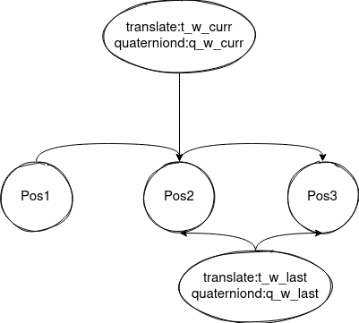
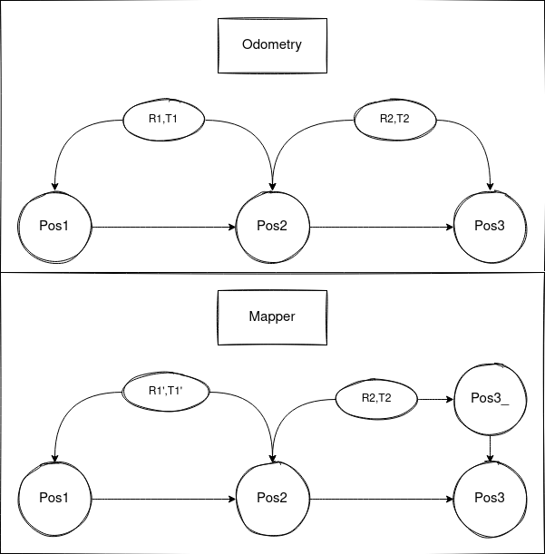

１．先平移后旋转和先旋转后平移所得到的结果是否一致？

> **t_w_curr = t_w_curr + q_w_curr * t_last_curr;**
>
> **q_w_curr = q_w_curr * q_last_curr;**

２．mapper是如何对odometry所得到的位姿进行优化的？

* 在mapper中求解R2'和T2'
* 根据mapper_pos3_将当前帧点云投影到世界坐标系mapper_pos1
* 在全局地图内寻找当前点云的对应点云
* 将对应点云投影回mapper_pos3_并与点云帧进行匹配
* 将odometry_pos3与mapper_pos3\_之间的位姿差作为mapper_pos3_和mapper_pos3之间的位姿差

３．mapper中是如何寻找对应点的？

* mapper中的匹配方式为scan-to-map
* mapper中scan寻找特征点的方式与odometry中一致（通过计算曲率），但所选择的点数更多了，体现在代码上就是增加曲率筛选的阈值；基于在scan中筛选出的特征点，在map地图中使用kdtree筛选出与之距离最近的五个点．
* 对五个点（5x3的一个矩阵）进行主成分分析，求解其特征向量，模最大的向量为点的主要分布方向（线特征），与模最小的特征向量构成平面（面特征）
